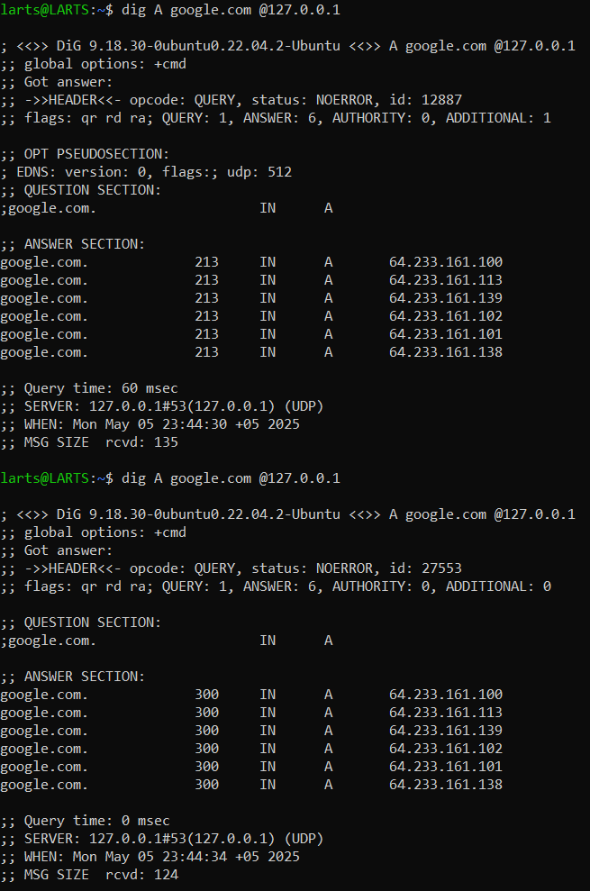
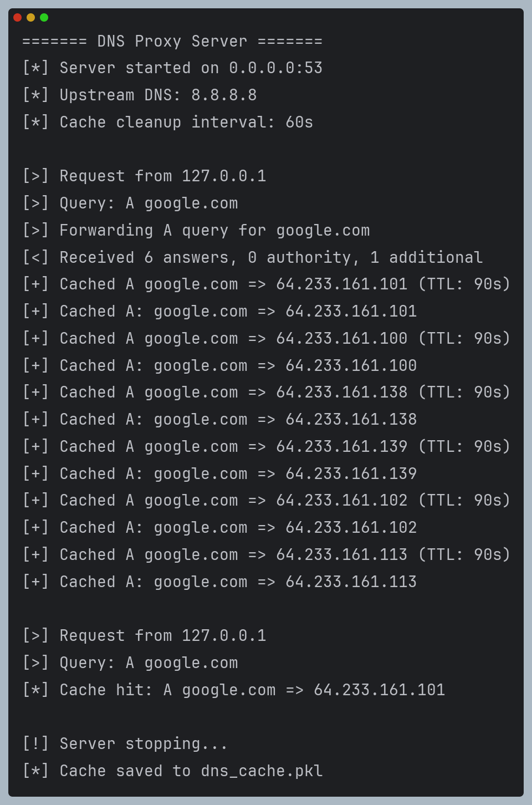

# Кэширующий DNS-сервер

Реализация кэширующего DNS-прокси сервера с поддержкой основных типов записей.

## Функциональные особенности

- Поддержка DNS-записей типов: A, AAAA, NS, PTR
- Кэширование всех полученных ресурсных записей
- Автоматическое удаление просроченных записей (по TTL)
- Сохранение кэша на диск при завершении работы
- Восстановление кэша при запуске с валидацией TTL
- Потокобезопасная работа с кэшем
- Логирование операций в консоль

## Технические требования

- Python 3.6 или выше
- Права root для работы на стандартном порту DNS (53)

## Запуск сервера

Чтобы запустить сервер, выполните эту команду:
```bash
sudo python3 server.py
```

## Примеры работы
На данных скриншотах можно увидеть примеры работы сервера, а также кэш-промаха и кэш-попадания при A запросе:

<div style="display: flex; justify-content: center; gap: 10px;">
  
  
</div>
